# hello_word

**Nama  :** Veren Regina Tirsya
**NIM   :** 2341760127
**Kelas :** SIB 3D

---
A new Flutter project.

---

# Praktikum 3 - Langkah 11
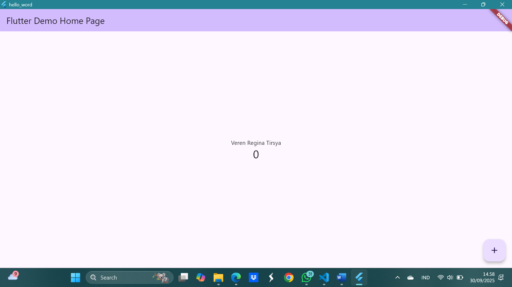

---

# Praktikum 4 - Langkah 1
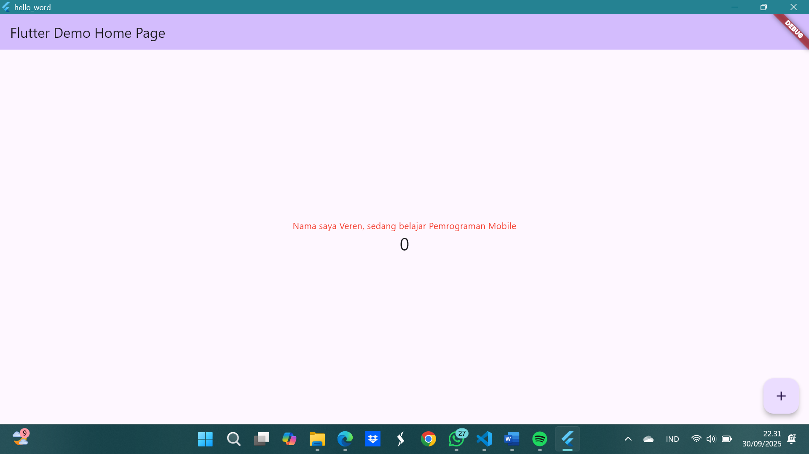

---

# Praktikum 4 - Langkah 2
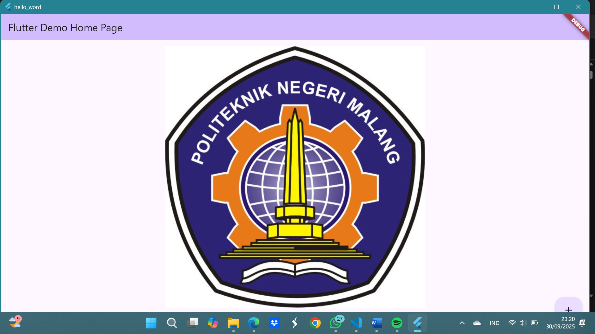

---

# Praktikum 5 - Langkah 1 -> LoadingCupertino();
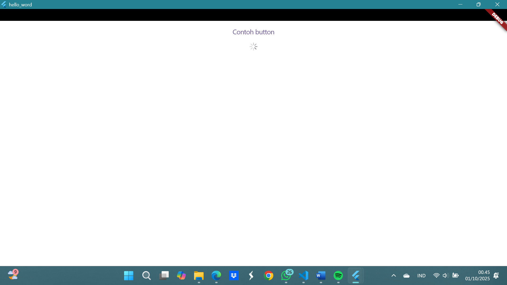

**Penjelasan:** menekan button tidak mengubah apa-apa karena callback kosong dan indikator menampilkan loading muter.

---

# Praktikum 5 - Langkah 2 -> FabWidget();
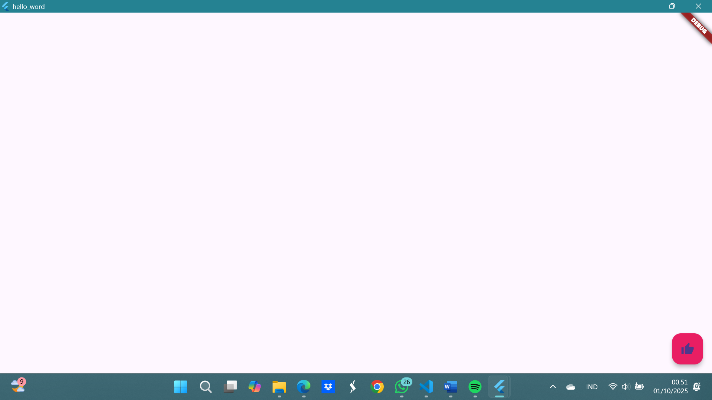

**Penjelasan:** Ketika FAB ditekan muncul SnackBar sebagai contoh aksi.

---

# Praktikum 5 - Langkah 3 -> ScaffoldWidget();
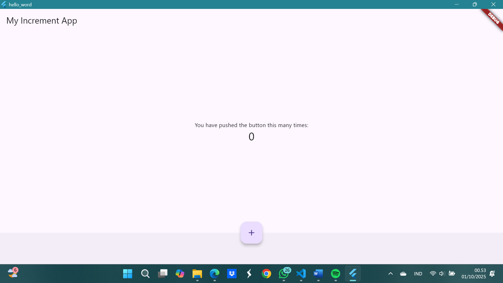

**Penjelasan:** Tekan floating button untuk menambah nilai counter.

---

# Praktikum 5 - Langkah 4 -> DialogWidget();
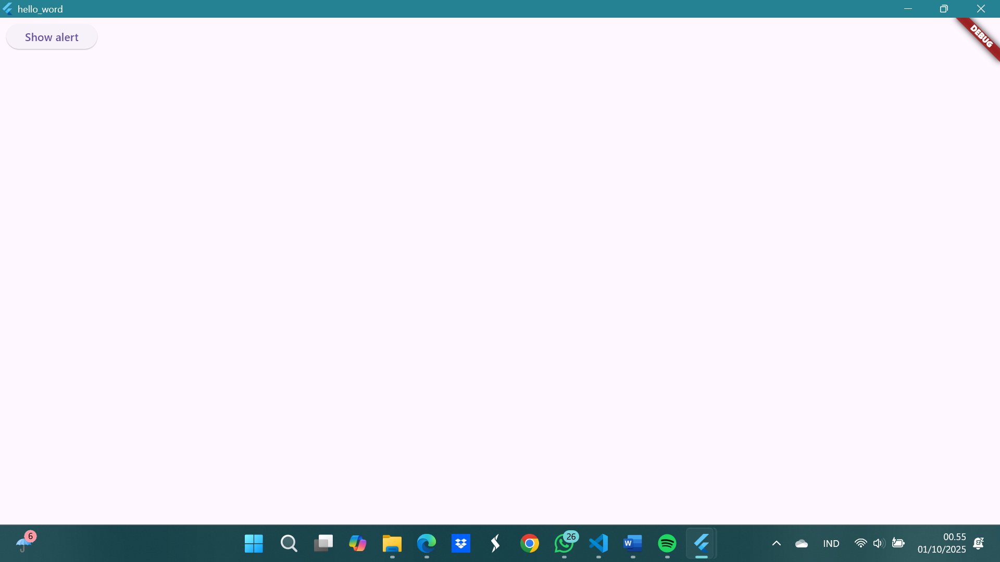
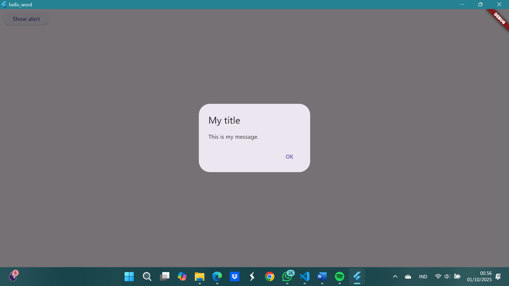

**Penjelasan:** Menampilkan tombol `Show alert` yang memunculkan `AlertDialog` dan AlertDialog menampilkan judul & pesan juga tombol OK untuk menutup dialog.

---

# Praktikum 5 - Langkah 5 -> TextFieldWidget();
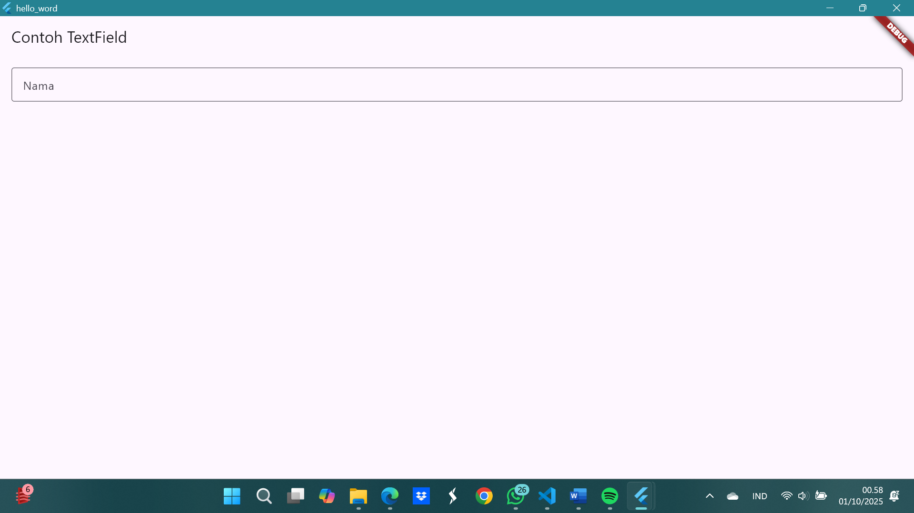
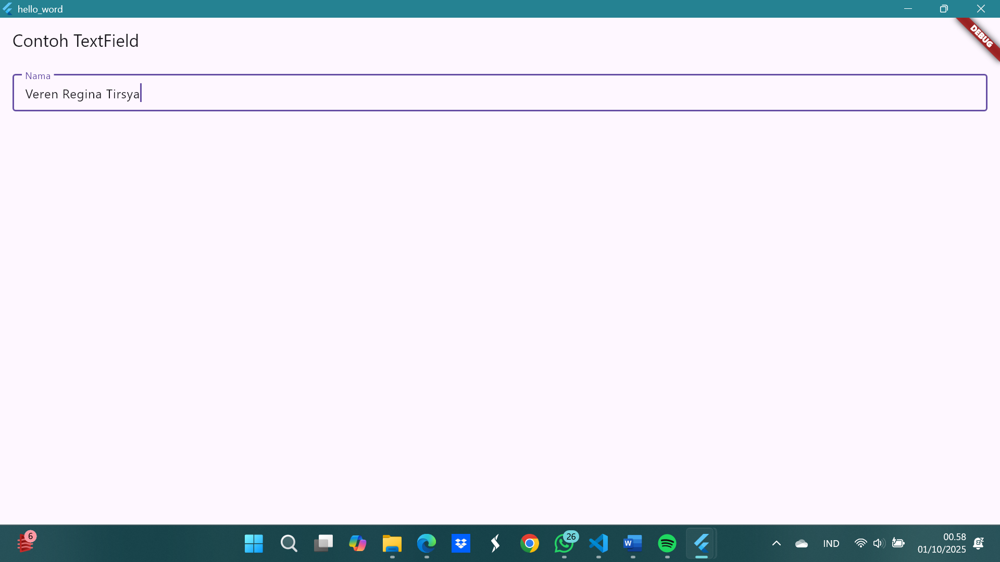

**Penjelasan:** Contoh input `TextField` dengan label `Nama`.

---

# Praktikum 5 - Langkah 6 -> DatePickerWidget;
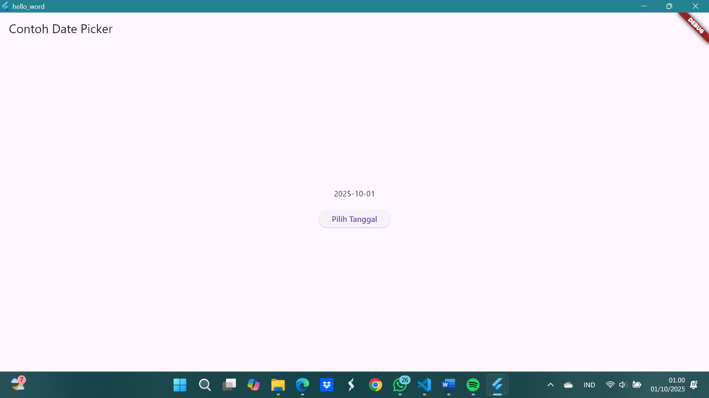
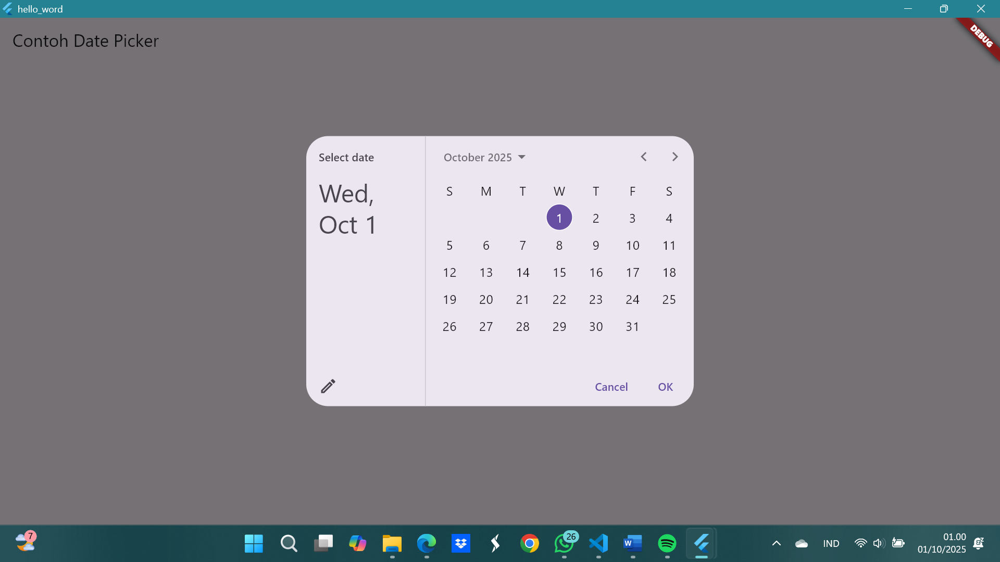

**Penjelasan:** Menampilkan date & button pilih tanggal. 

---

## Laporan Praktikum
Klik link berikut untuk melihat laporan praktikum jobsheet Flutter 1
👉 [Lihat Laporan Jobsheet PDF](./docs_jobsheet/28_Veren%20Regina%20Tirsya_SIB3D_Flutter1.pdf)